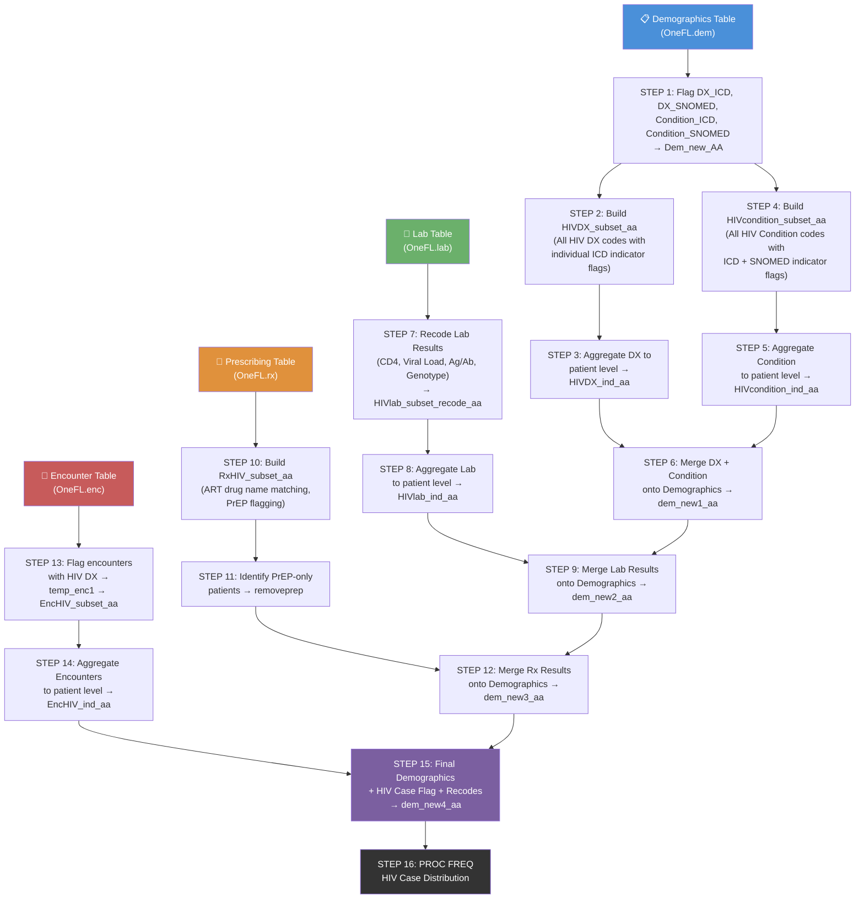
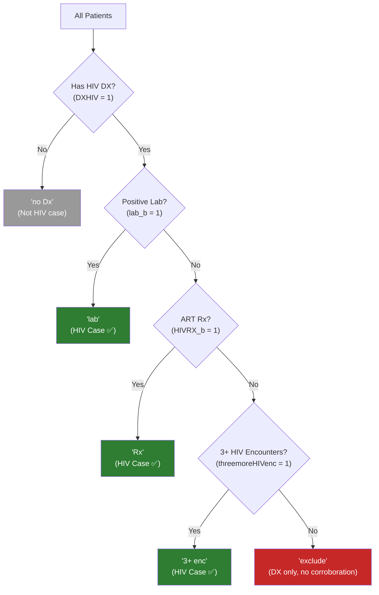
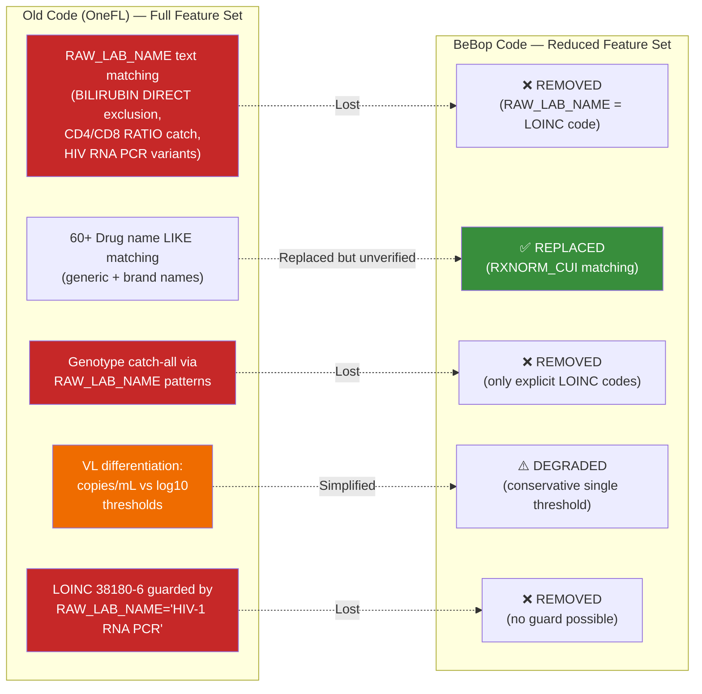

# HIV Case-Finding Algorithm — Gap Report & Data-Flow Workflow

> **Document Scope:** This report compares the **original OneFL/HIVCP SAS code** (`old_code.txt`) with the **BeBop-adapted SAS code** (`bebop_hiv_code.sas`), identifies gaps and shortcomings in the BeBop version, and provides a high-level data-flow diagram of the algorithm.

---

## 1. High-Level Algorithm Workflow (Old OneFL Code)

The original HIVCP SAS code follows a **multi-evidence cascading algorithm** to identify HIV-positive patients. The pipeline progressively enriches a central demographics table with flags from Diagnosis, Condition, Lab, Prescribing, and Encounter data.



---

## 2. Step-by-Step Workflow Description (Old OneFL Code)

| Step | Input Table(s) | Output Table | What It Does |
|------|----------------|--------------|--------------|
| **1** | `OneFL.dem`, `OneFL.dx`, `OneFL.condition`, `snomed_list` | `Dem_new_AA` | Flags each patient with 5 binary indicators: `DX_ICD`, `DX_SNOMED`, `Condition_ICD`, `Condition_SNOMED`, `DXHIV` (combined) |
| **2** | `OneFL.dx`, `snomed_list` | `HIVDX_subset_aa` | Subsets DX table to only HIV-related rows; creates 10 ICD indicator columns (042g, Z21, Z5320, B9735, 043g, 044g, 7953, O987g, B20g, V08) |
| **3** | `HIVDX_subset_aa` | `HIVDX_ind_aa` | Aggregates DX indicators to patient level (sums + date range) |
| **4** | `OneFL.condition`, `snomed_list` | `HIVcondition_subset_aa` | Subsets Condition table; creates 10 ICD + 4 SNOMED indicator columns |
| **5** | `HIVcondition_subset_aa` | `HIVcondition_ind_aa` | Aggregates Condition indicators to patient level |
| **6** | `Dem_new_AA`, `HIVDX_ind_aa`, `HIVcondition_ind_aa` | `dem_new1_aa` | LEFT JOINs DX + Condition aggregates onto demographics; creates 24 binary flags (dx_ICD_*, con_ICD_*, con_SNO_*) |
| **7** | `OneFL.lab`, `loinc_list` | `HIVlab_subset_recode_aa` | Recodes all lab results into binary flags: CD4 (3 tests), Viral Load (5 tests × 2 cutoffs), Ag/Ab (7 tests), Genotype, and composite flags (VL, VL_50, AgAb, CD4, CD4_geno) |
| **8** | `HIVlab_subset_recode_aa` | `HIVlab_ind_aa` | Aggregates lab flags to patient level |
| **9** | `dem_new1_aa`, `HIVlab_ind_aa` | `dem_new2_aa` | Merges lab results; creates `lab`, `lab_b`, `lab_50`, `lab_b_50`, and individual lab component flags |
| **10** | `OneFL.rx` | `RxHIV_subset_aa` | Subsets Rx table using 60+ drug name LIKE matches (generic + brand); flags PrEP vs non-PrEP |
| **11** | `RxHIV_subset_aa` | `removeprep` | Identifies PrEP-only patients |
| **12** | `dem_new2_aa`, `RxHIV_subset_aa`, `OneFL.rx`, `OneFL.disp`, `ART_NDC` | `dem_new3_aa` | Merges Rx flags (`HIVRX`, `HIVRX_b`, `HIVRX_b_prep`) |
| **13** | `OneFL.enc`, `HIVdx_subset_aa`, `HIVcondition_subset_aa` | `temp_enc1` → `EncHIV_subset_aa` | Flags encounters with HIV DX; aggregates per patient |
| **14** | `EncHIV_subset_aa` | `EncHIV_ind_aa` | Deduplicates to patient level |
| **15** | `dem_new3_aa`, `EncHIV_ind_aa` | `dem_new4_aa` | Final table: `HIVcase` flag, `group_7` classification, `algo_flow`, demographic recodes (Race, Hispanic, Zip) |
| **16** | `dem_new4_aa` | Console output | `PROC FREQ` on `HIVcase` |

---

## 3. HIV Case Definition Logic

A patient is classified as an **HIV case** (`HIVcase = 1`) when:

```
DXHIV = 1          (has an HIV diagnosis via ICD or SNOMED)
  AND at least ONE of:
    ├── lab_b = 1       (any positive lab result)
    ├── HIVRX_b = 1     (any ART prescription)
    └── 3+ HIV encounters  (threemoreHIVenc = 1)
```

**Algorithm flow decision tree:**



---

## 4. Gap Analysis — BeBop SAS Code Shortcomings

### 4.1 Critical Gaps (Logic That Is Missing or Non-Functional)

| # | Gap | Old Code (OneFL) | BeBop Code | Impact | Severity |
|---|-----|-------------------|------------|--------|----------|
| **G1** | **BILIRUBIN DIRECT exclusion missing** | LOINC `24467-3` excluded `BILIRUBIN DIRECT` records via `RAW_LAB_NAME` check | Cannot exclude — `RAW_LAB_NAME` = LOINC code in BeBop | **False positives**: Bilirubin lab results could be counted as CD4 tests | 🔴 Critical |
| **G2** | **CD4/CD8 Ratio text match lost** | `upcase(RAW_LAB_NAME)='CD4/CD8 RATIO'` used as **additional** catch for CD4 ratio tests alongside LOINC `54218-3` | Only LOINC `54218-3` matched | **False negatives**: Any CD4/CD8 ratio tests NOT coded with `54218-3` will be missed | 🟡 Medium |
| **G3** | **Viral Load RAW_LAB_NAME differentiation lost** | LOINC `29539-4` differentiated between copies/mL and log10 results using `RAW_LAB_NAME` (different thresholds: ≥20 for copies, ≥1.3 for log) | Uses conservative ≥1.3 (log threshold) for ALL `29539-4` results | **Potential over-counting**: Copies/mL values between 1.3–20 would be flagged as positive when they should be negative | 🟡 Medium |
| **G4** | **HIV genotype/phenotype text catch-all removed** | Additional catch: `upcase(RAW_LAB_NAME) LIKE '%HIV%' AND ('%PHENOTYPE%' or '%GENO%')` | Only explicit LOINC codes matched for genotype | **False negatives**: Genotype/phenotype tests with unlisted LOINC codes missed | 🟡 Medium |
| **G5** | **Viral Load fallback matching removed** | Fallback for VL: `RAW_LAB_NAME IN ('HIV-1 RNA PCR, Copies/ML', 'HIV-1 RNA by PCR')` with `RESULT_NUM >= 20` | No fallback at all | **False negatives**: VL tests not mapped to standard LOINC codes missed | 🟡 Medium |
| **G6** | **Lab WHERE clause — text filter removed** | `upcase(RAW_LAB_NAME) LIKE '%HIV%' OR upcase(RAW_LAB_NAME)='CD4/CD8 RATIO'` as additional rows to include | Only `loinc_list` used for filtering | **Data loss**: HIV-related labs not in `loinc_list` will be excluded entirely | 🟡 Medium |
| **G7** | **Condition table ICD logic may be non-functional** | Condition table had both ICD (`09`/`10`) and SNOMED types | BeBop Condition table appears to have SNOMED-only (`SM`) data per `onefl_vs_bebopp_differences.html` | **Dead code**: ICD matching in Condition table steps unlikely to match any records — `Condition_ICD` flag probably always 0 | 🟠 High |
| **G8** | **RXNORM_CUI codes unverified** | Drug matching via 60+ explicit generic/brand names | RXNORM_CUI codes used — several noted as mapping to wrong drugs in BeBop sample (Nevirapine → clomiPRAMINE, Evotaz → Phenylephrine, Biktarvy → HYDROcodone/ZOHYDRO) | **False positives**: Non-ART drugs could be flagged as ART prescriptions | 🔴 Critical |
| **G9** | **DX_TYPE '09' existence unconfirmed** | ICD-9 and ICD-10 matching active | BeBop may not contain ICD-9 codes (per differences doc) — `DX_TYPE = '09'` matching may produce no results | **Dead code**: All ICD-9 specific logic may be non-functional | 🟡 Medium |
| **G10** | **LOINC `38180-6` is actually Hepatitis C** | LOINC `38180-6` is for Hep C RNA but was matched with `RAW_LAB_NAME='HIV-1 RNA PCR (LOG)'` to confirm HIV usage | Without `RAW_LAB_NAME` verification, this may match Hep C labs | **False positives**: Hep C viral load could be counted as HIV viral load | 🔴 Critical |

---

### 4.2 Data Schema Adaptation Gaps

| # | Issue | Details | Status in BeBop Code |
|---|-------|---------|----------------------|
| **S1** | `PATID` → `ID` renaming | Column name change | ✅ Addressed |
| **S2** | `AGE` → calculated from `BIRTH_DATE` | No AGE column in BeBop | ✅ Addressed |
| **S3** | `RACE` leading zeros (`'01'` vs `'1'`) | 2-digit codes in BeBop | ✅ Addressed |
| **S4** | Date format `MM/DD/YYYY` → `YYYY-MM-DD` | `input()` with `yymmdd10.` used | ✅ Addressed |
| **S5** | `RAW_LAB_NAME` = LOINC code | Cannot use for text matching | ⚠️ Handled but with **lost functionality** (see G1–G6) |
| **S6** | `RAW_RX_MED_NAME` → RXNORM_CUI | Changed to RXNORM matching | ⚠️ Handled but with **unverified codes** (see G8) |
| **S7** | `RESULT_QUAL` values | Need to confirm `POSITIVE`/`REACTIVE` exist in BeBop | ❓ **Unverified** |
| **S8** | ZIP_CODE format (hyphenated) | `compress(ZIP_CODE, "-")` already handles | ✅ Addressed |

---

### 4.3 Code Quality / Logic Concerns

| # | Issue | Details |
|---|-------|---------|
| **C1** | **Missing `DX_SNOMED` in DXHIV composite** | In both old and new code, `DXHIV = DX_ICD OR Condition_ICD OR Condition_SNOMED`. The `DX_SNOMED` flag (SNOMED codes found in the DX table) is computed but **never used** in the `DXHIV` composite flag or any downstream logic. This is a pre-existing bug carried into BeBop. |
| **C2** | **Redundant EncHIV_subset_aa step** | Step 13 creates `EncHIV_subset_aa` with inline aggregate, then Step 14 re-aggregates from it. The `select *, MIN(...) ...` in Step 13 is questionable — it mixes detail and aggregate rows. This was inherited from the old code. |
| **C3** | **`lab38180_50` uses LOINC for Hep C** | Even in the old code, `38180-6` is documented as a Hepatitis C LOINC code. Relying on it without the `RAW_LAB_NAME` guard is risky. |
| **C4** | **No validation of `ART_NDC` / `snomed_list` / `loinc_list`** | The code references external lookup tables (`snomed_list`, `loinc_list`, `ART_NDC`) but never validates they exist or have correct content for BeBop data. |
| **C5** | **RACE code `'07'` added without documentation** | BeBop code adds `RACE = '07' → 'Refuse to answer'` which didn't exist in the old code. This is noted as an improvement but lacks documentation of source. |

---

## 5. Features Present in Old Code but Missing/Degraded in BeBop Code



---

## 6. Recommendations

### Immediate Actions Required

1. **Verify RXNORM_CUI mappings** (G8) — Cross-reference every RXNORM code in the BeBop code against the actual BeBop prescribing data. Remove codes that map to non-ART drugs (e.g., `857297` if it maps to clomiPRAMINE, `1049182` if it maps to Phenylephrine).

2. **Remove or guard LOINC `38180-6`** (G10) — Either remove this code entirely from BeBop HIV matching, or add a RESULT_NUM range guard to reduce Hep C contamination.

3. **Confirm RESULT_QUAL values** (S7) — Run `SELECT DISTINCT RESULT_QUAL FROM bebopp.lab` to verify `POSITIVE` and `REACTIVE` strings exist.

4. **Confirm DX_TYPE values** (G9) — Run `SELECT DISTINCT DX_TYPE FROM bebopp.dx` to check if ICD-9 (`'09'`) exists.

5. **Confirm CONDITION_TYPE values** (G7) — Run `SELECT DISTINCT CONDITION_TYPE FROM bebopp.condition` to verify whether ICD types exist or if the table is SNOMED-only.

### Logic Improvements

6. **Add BILIRUBIN guard** for LOINC `24467-3` — Consider filtering by `RESULT_NUM` range (e.g., CD4 values are typically 0–2000 cells/µL; bilirubin values are typically 0–15 mg/dL). Example:
   ```sas
   case when LAB_LOINC = '24467-3' and RESULT_NUM >= 15 and RESULT_NUM < 2000 then 1
   ```

7. **Include `DX_SNOMED` in DXHIV** (C1) — Fix the pre-existing bug:
   ```sas
   case when calculated Dx_ICD=1 or calculated DX_SNOMED=1
        or calculated Condition_ICD=1 or calculated Condition_SNOMED=1
        then 1 else 0 end as DXHIV
   ```

8. **Document all RXNORM_CUI codes** — Create a reference table mapping each RXNORM code to its drug name for auditability.

---

## 7. Summary Scorecard

| Domain | Old Code Coverage | BeBop Code Coverage | Gap Level |
|--------|:-----------------:|:-------------------:|:---------:|
| **Diagnosis (DX) — ICD** | ✅ Full | ✅ Full | 🟢 None |
| **Diagnosis (DX) — SNOMED** | ✅ Full | ✅ Full | 🟢 None |
| **Condition — ICD** | ✅ Full | ⚠️ Likely dead code | 🟠 High |
| **Condition — SNOMED** | ✅ Full | ✅ Full | 🟢 None |
| **Lab — CD4** | ✅ Full (with guards) | ⚠️ Missing BILIRUBIN guard | 🟡 Medium |
| **Lab — Viral Load** | ✅ Full (with RAW_LAB_NAME) | ⚠️ Degraded (no text matching) | 🟡 Medium |
| **Lab — Ag/Ab** | ✅ Full | ✅ Full (LOINC-only) | 🟢 None |
| **Lab — Genotype** | ✅ Full (with catch-all) | ⚠️ Reduced (LOINC only) | 🟡 Medium |
| **Prescribing (Rx)** | ✅ Full (60+ drug names) | ⚠️ Replaced but unverified CUIs | 🔴 Critical |
| **Encounter** | ✅ Full | ✅ Full | 🟢 None |
| **Demographics** | ✅ Full | ✅ Adapted | 🟢 None |
| **HIV Case Algorithm** | ✅ Full | ✅ Full (same logic) | 🟢 None |

**Overall Assessment:** The BeBop code successfully adapts the overall architecture and HIV case-finding algorithm, but has **3 critical gaps** (BILIRUBIN contamination, unverified RXNORM codes, Hep C LOINC code) and **several medium gaps** from lost `RAW_LAB_NAME` functionality that require attention before production use.

---

*Document generated on: 2026-03-19*
*Source files: `old_code.txt`, `bebop_hiv_code.sas`, `onefl_vs_bebopp_differences.html`*
